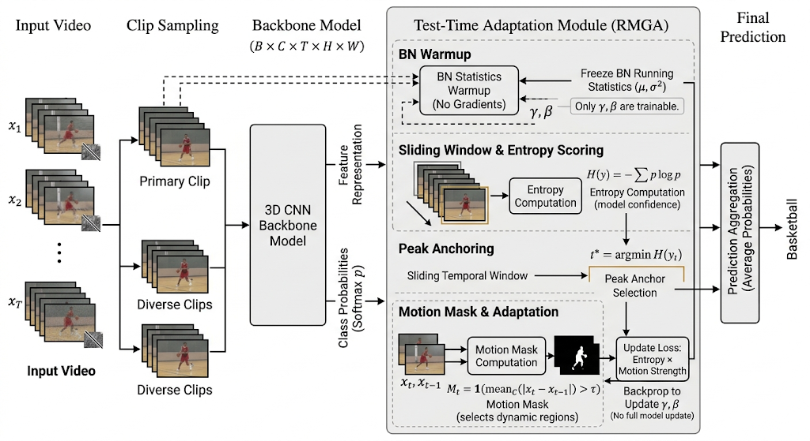

# RMGA: Robust Motion Gated Adaptation for Test-Time Video Streams

This repository provides an end-to-end workflow for:

- building corruption benchmarks from UCF50 videos,
- training and evaluating action recognition models,
- evaluating test-time adaptation methods (ViTTA and RMGA),
- reproducing mixed corruption assignments from CSV for strict experiment replay.

The project is organized for practical experimentation with clean-vs-corrupted domain shifts.



## Contents

- [Project Scope](#project-scope)
- [Repository Layout](#repository-layout)
- [Dataset Setup](#dataset-setup)
- [Environment Setup](#environment-setup)
- [Quick Start](#quick-start)
- [Script Usage](#script-usage)
- [Backbone Selection](#backbone-selection)
- [Outputs and Artifacts](#outputs-and-artifacts)
- [Reproducibility Notes](#reproducibility-notes)
- [Troubleshooting](#troubleshooting)
- [License](#license)

## Project Scope

The codebase includes five primary Python scripts:

| Script | Purpose |
| --- | --- |
| `corrupt_ucf50.py` | Generate corrupted datasets from clean UCF50 videos. Supports separate-per-corruption outputs and mixed mode with CSV logging. |
| `corrupt_ucf50_from_csv.py` | Recreate `UCF50_mixed` exactly from a CSV mapping (`video_path`, `corruption_type`). |
| `video_ucf50_action_recognition.py` | Baseline training and evaluation pipeline with optional ViTTA at test time. |
| `video_RMGA_action_recognition.py` | RMGA-only evaluation pipeline using pre-trained weights. |
| `get_metadata.py` | Utility to export video metadata CSV (fps, frame count, duration). |

## Repository Layout

```text
RMGA/
|- corrupt_ucf50.py
|- corrupt_ucf50_from_csv.py
|- get_metadata.py
|- video_ucf50_action_recognition.py
|- video_RMGA_action_recognition.py
|- README.md
|- LICENSE
|- datasets/
|  |- .gitkeep
|  |- UCF50/                      # place original UCF50 here
|  |- UCF50_mixed/                # generated mixed corruption dataset
|  |- UCF50_mixed_labels.csv      # generated/used corruption mapping
|  |- ucf50_video_metadata.csv    # generated metadata table
|- Experiments_output/            # logs, figures, experiment notes
```

## Dataset Setup

1. Download UCF50 from the official page: https://www.crcv.ucf.edu/data/UCF50.php
2. Extract it so your videos are under `datasets/UCF50/<ClassName>/*.avi`.

Expected minimum structure:

```text
datasets/
|- UCF50/
|  |- ApplyEyeMakeup/
|  |  |- v_ApplyEyeMakeup_g01_c01.avi
|  |- ApplyLipstick/
|  |  |- v_ApplyLipstick_g01_c01.avi
```

Notes:

- Corruption scripts currently discover source videos using `*.avi`.
- Recognition scripts read `.avi`, `.mp4`, `.mov`, and `.mkv`.

## Environment Setup

Use Python 3.9+ (3.10 or 3.11 recommended).

Create and activate a virtual environment:

```bash
python -m venv .venv
```

Windows PowerShell:

```powershell
.\.venv\Scripts\Activate.ps1
```

Linux/macOS:

```bash
source .venv/bin/activate
```

Install core dependencies:

```bash
pip install --upgrade pip
pip install numpy opencv-python scikit-learn tqdm
pip install torch torchvision
```

Optional dependency for real H.265 corruption:

- Install `ffmpeg` with `libx265` support.
- Verify with:

```bash
ffmpeg -codecs
```

If unavailable, `h265_abr` automatically falls back to heavy JPEG artifacts.

## Quick Start

### 1) Optional: Generate metadata CSV

```bash
python get_metadata.py
```

This writes `datasets/ucf50_video_metadata.csv` with columns:

- `Video_Path`
- `FPS`
- `Total_Frames`
- `Duration_Sec`

### 2) Generate mixed corruption dataset + mapping CSV

```bash
python corrupt_ucf50.py --corruption all --mixed --prob 0.70 --severity 4 --src ./datasets/UCF50
```

Outputs:

- `datasets/UCF50_mixed/`
- `datasets/UCF50_mixed_labels.csv`

### 3) Train baseline and evaluate on mixed set

```bash
python video_ucf50_action_recognition.py --mode train_eval --epochs 40 --batch_size 8
```

### 4) Run RMGA evaluation using trained weights

```bash
python video_RMGA_action_recognition.py --load_weights ./r3d_18_best_model.pth --mixed_dir ./datasets/UCF50_mixed
```

## Script Usage

### `corrupt_ucf50.py`

Generates corrupted videos from a clean UCF50 source.

Supported corruption types:

- `gauss`
- `pepper`
- `salt`
- `shot`
- `zoom`
- `impulse`
- `defocus`
- `motion`
- `jpeg`
- `contrast`
- `rain`
- `h265_abr`

You can pass one or more types, or `all`.

Examples:

Separate datasets per corruption type:

```bash
python corrupt_ucf50.py --corruption rain motion jpeg --severity 4 --prob 0.70
```

Mixed mode (one assigned corruption per video, tracked in CSV):

```bash
python corrupt_ucf50.py --corruption all --mixed --seed 42 --workers 8
```

Important arguments:

- `--corruption` (required): list of corruption types or `all`
- `--mixed`: enable mixed dataset generation (`UCF50_mixed` + CSV log)
- `--prob` (default `0.70`): per-frame corruption probability
- `--severity` (default `4`): corruption intensity (`1..5`)
- `--src` (default `./datasets/UCF50`): clean source root
- `--dst-root`: parent output root (default parent of `--src`)
- `--workers`: multiprocessing workers
- `--seed`: reproducibility seed

### `corrupt_ucf50_from_csv.py`

Recreates `UCF50_mixed` from a fixed CSV mapping.

This is intended for reproducible replay of mixed corruption assignments.

Example:

```bash
python corrupt_ucf50_from_csv.py --path ./datasets/UCF50_mixed_labels.csv --src ./datasets/UCF50 --prob 0.70 --severity 4 --workers 8
```

Validation behavior:

- Requires CSV header columns: `video_path`, `corruption_type`
- Rejects unknown corruption types
- Fails if a source video is missing from CSV
- Fails if CSV includes video paths not present under source

Important arguments:

- `--path` (default `./datasets/UCF50_mixed_labels.csv`)
- `--prob` (default `0.70`)
- `--severity` (default `4`)
- `--src` (default `./datasets/UCF50`)
- `--dst-root` (default parent of `--src`)
- `--workers`
- `--seed`

### `video_ucf50_action_recognition.py`

Baseline training and evaluation pipeline.

Behavior summary:

- Builds a stratified split from clean UCF50 labels.
- Trains on clean subset.
- Evaluates on matched test subset from `UCF50_mixed`.
- Optional ViTTA adaptation can be enabled at inference.

Examples:

Train and evaluate:

```bash
python video_ucf50_action_recognition.py --mode train_eval --epochs 40 --batch_size 8 --num_frames 16 --img_size 112
```

Evaluate only (no training):

```bash
python video_ucf50_action_recognition.py --mode eval_only --load_weights ./r3d_18_best_model.pth
```

Evaluate only with ViTTA:

```bash
python video_ucf50_action_recognition.py --mode eval_only --load_weights ./r3d_18_best_model.pth --ViTTA --vitta_clips 4 --vitta_steps 1 --vitta_lr 1e-4
```

Important arguments:

- Paths: `--clean_dir`, `--mixed_dir`, `--ckpt_dir`, `--best_model`
- Data: `--num_frames`, `--img_size`, `--split_seed`, `--test_ratio`
- Training: `--epochs`, `--batch_size`, `--lr`, `--weight_decay`, `--num_workers`, `--save_every`
- Inference/TTA: `--ViTTA`, `--vitta_clips`, `--vitta_steps`, `--vitta_lr`
- Mode control: `--mode {train_eval,eval_only}`, `--load_weights`

### `video_RMGA_action_recognition.py`

RMGA-only evaluation script.

This script does not train. It requires a pre-trained checkpoint via `--load_weights`.

Example:

```bash
python video_RMGA_action_recognition.py --load_weights ./r3d_18_best_model.pth --mixed_dir ./datasets/UCF50_mixed --rmga_window 8 --rmga_steps 1 --rmga_lr 1e-4 --rmga_tau 0.05
```

Important arguments:

- Paths: `--clean_dir`, `--mixed_dir`, `--load_weights` (required)
- Data: `--num_frames`, `--img_size`, `--split_seed`, `--test_ratio`
- RMGA: `--rmga_window`, `--rmga_steps`, `--rmga_lr`, `--rmga_tau`, `--rmga_last_blocks`, `--rmga_fp16`, `--rmga_extra_clips`

Reported metrics include:

- Overall accuracy
- Mean prediction entropy
- Mean confidence
- Stability index (std of per-class accuracy)
- Per-class accuracy table

### `get_metadata.py`

Scans `datasets/UCF50` and writes metadata CSV to `datasets/ucf50_video_metadata.csv`.

```bash
python get_metadata.py
```

If your dataset path differs, update `TARGET_FOLDER` in the script.

## Backbone Selection

Backbone selection is controlled in each recognition script by the module-level `MODEL_NAME` constant.

Typical choices in current code:

- `r3d_18`
- `mc3_18`
- `r2plus1d_18`
- `mobilenet_v3_small`
- `efficientnet_b1`
- `resnet18`

Important:

- Use weights compatible with the selected backbone and head dimensions.
- Keep the same `MODEL_NAME` between training and RMGA evaluation when reusing checkpoints.

## Outputs and Artifacts

Primary generated artifacts:

- `datasets/UCF50_mixed/` from mixed corruption generation
- `datasets/UCF50_<corruption>/` for separate corruption generation mode
- `datasets/UCF50_mixed_labels.csv` corruption assignment log
- `datasets/ucf50_video_metadata.csv` metadata export
- `checkpoints/epoch_XXX.pth` periodic training checkpoints
- `<MODEL_NAME>_best_model.pth` best validation checkpoint (default naming)

`Experiments_output/` stores experimental notes, logs, plots, and report assets.

## Reproducibility Notes

- Fix both corruption seed (`--seed`) and split seed (`--split_seed`) for repeatable runs.
- Keep directory structure of `UCF50` and `UCF50_mixed` aligned.
- Use `corrupt_ucf50_from_csv.py` when exact mixed corruption replay is required.
- Store command lines and seeds alongside checkpoints for traceability.

## Troubleshooting

### No videos found

If you see errors such as "No .avi files found", verify that:

- `--src` points to the UCF50 class-root directory.
- videos are present under class folders.
- source extensions match script expectations (`.avi` for corruption scripts).

### CSV validation failures in from-CSV mode

Ensure:

- CSV has header: `video_path,corruption_type`
- all paths in CSV are relative to source root
- all source videos are represented exactly once
- corruption types are from the supported list

### Weight loading errors

If checkpoint loading fails:

- confirm `--load_weights` path is correct
- verify checkpoint is from a compatible backbone
- use the same `MODEL_NAME` setting used during training

### H.265 behavior not matching expectation

If `ffmpeg` with `libx265` is unavailable, `h265_abr` uses JPEG fallback proxy artifacts.
Install a full ffmpeg build with H.265 encoder support for true H.265 artifacts.

## License

This project is licensed under the Eclipse Public License 2.0. See [LICENSE](LICENSE) for details.
